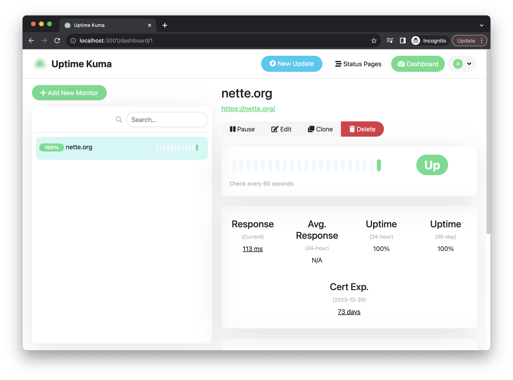

# Litestream + Uptime Kuma + Flyio

## Prerequisites

- AWS S3
- Fly.io
- Docker

## Running locally

1. Create `.env` from `.env.example` and fill AWS S3 details.

2. Start docker container via `make dev`.

## Deploy to Fly.io

1. Run `fly launch` (no need for postgres, redis, upstash, etc).

2. Run `cat .env | fly secrets import` for setup ENV in Flyio.

2. Run `fly deploy`.

## Demo

